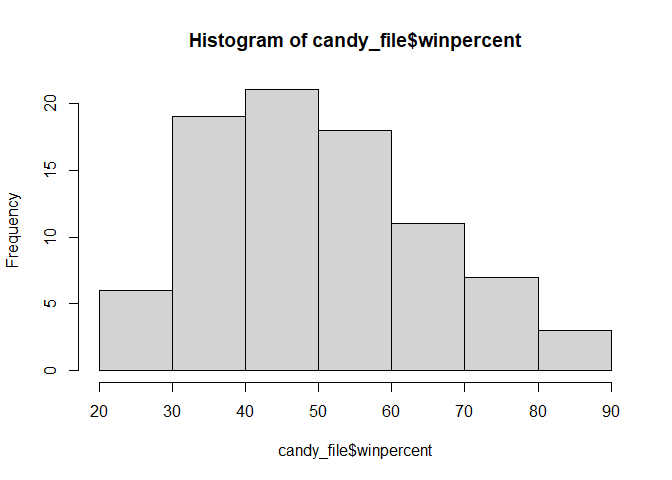
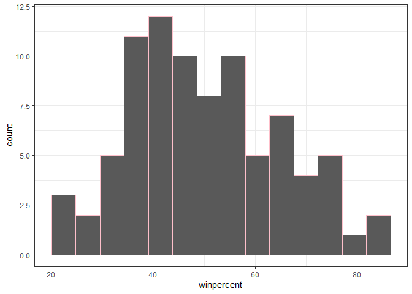
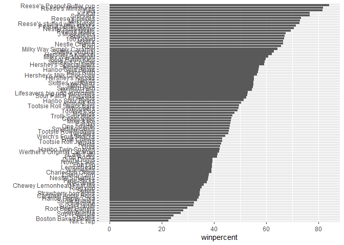
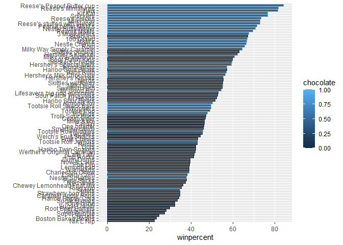
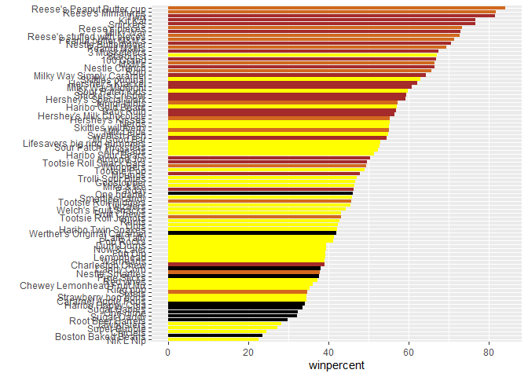
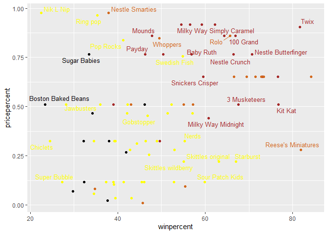
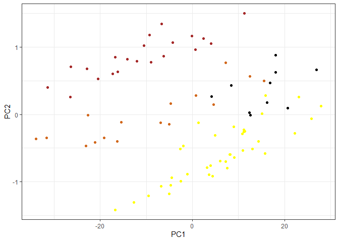
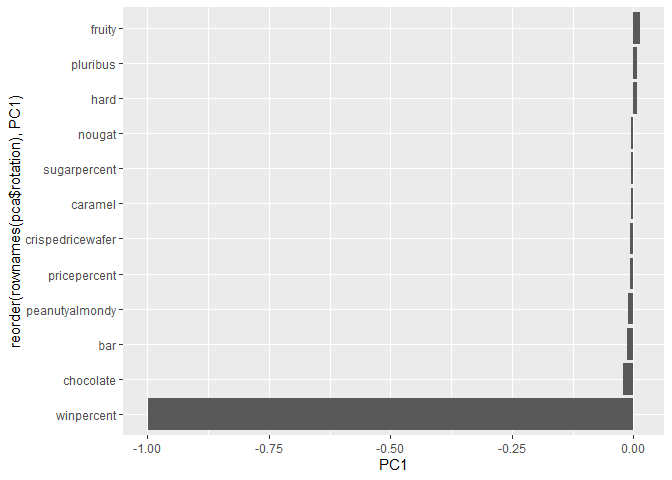

# Class 09, Candy Data!
Karolina Navarro (A19106745)

- [Background](#background)
- [Data Import](#data-import)
- [Exploratory Analysis](#exploratory-analysis)
- [Overall Candy Rankings](#overall-candy-rankings)
- [Taking a look at priceprint](#taking-a-look-at-priceprint)
- [Exploring the correlation data](#exploring-the-correlation-data)
- [PCA](#pca)

## Background

In this mini project, you will explore FiveThirtyEight’s Halloween Candy
data set

We will use lots of **gglpot** some basic stats, correlation analysis
and PCA to make sense of the landscape of US candy - something hopefully
more relatable than the proteomics and transcriptomics

## Data Import

``` r
candy_file <- read.csv("candy-data.csv", row.names = 1)
head(candy_file)
```

                 chocolate fruity caramel peanutyalmondy nougat crispedricewafer
    100 Grand            1      0       1              0      0                1
    3 Musketeers         1      0       0              0      1                0
    One dime             0      0       0              0      0                0
    One quarter          0      0       0              0      0                0
    Air Heads            0      1       0              0      0                0
    Almond Joy           1      0       0              1      0                0
                 hard bar pluribus sugarpercent pricepercent winpercent
    100 Grand       0   1        0        0.732        0.860   66.97173
    3 Musketeers    0   1        0        0.604        0.511   67.60294
    One dime        0   0        0        0.011        0.116   32.26109
    One quarter     0   0        0        0.011        0.511   46.11650
    Air Heads       0   0        0        0.906        0.511   52.34146
    Almond Joy      0   1        0        0.465        0.767   50.34755

> Q1. How many different candy types are in this dataset?

``` r
nrow(candy_file)
```

    [1] 85

> Q2. How many fruity candy types are in the dataset?

``` r
sum(candy_file$fruity)
```

    [1] 38

> Q.3 What is your favorite candy (other than Twix) in the dataset and
> what is it’s winpercent value?

``` r
library(dplyr)
```


    Attaching package: 'dplyr'

    The following objects are masked from 'package:stats':

        filter, lag

    The following objects are masked from 'package:base':

        intersect, setdiff, setequal, union

``` r
candy_file |> 
  filter(row.names(candy_file)=="Mike & Ike") |> 
  select(winpercent)
```

               winpercent
    Mike & Ike   46.41172

> Q4. What is the winpercent value for “Kit Kat”?

``` r
candy_file["Kit Kat", "winpercent"]
```

    [1] 76.7686

> Q5. What is the winpercent value for “Tootsie Roll Snack Bars”?

``` r
candy_file["Tootsie Roll Snack Bars", "winpercent"]
```

    [1] 49.6535

> Q6. Is there any variable/column that looks to be on a different scale
> to the majority of the other columns in the dataset?

Yes!

> Q7. What do you think a zero and one represent for the
> `candy$chocolate` column?

1 means constains chocolate 0 means it does not contain any chocolate

## Exploratory Analysis

> Q8. Plot a histogram of winpercent values

``` r
hist(candy_file$winpercent)
```



``` r
library(ggplot2)


ggplot(candy_file) + 
  aes(x = winpercent) +
  geom_histogram(bins = 14, col="pink", ) + theme_bw()
```



> Q9. Is the distribution of winpercent values symmetrical?

No!

> Q10. Is the center of the distribution above or below 50%?

Below

``` r
summary(candy_file$winpercent)
```

       Min. 1st Qu.  Median    Mean 3rd Qu.    Max. 
      22.45   39.14   47.83   50.32   59.86   84.18 

> Q11. On average is chocolate candy higher or lower ranked than fruit
> candy?

1.  Find all chocolate candy
2.  Get their winpercent values
3.  Find the mean
4.  Find all fruity candy 5.Get their winpercent values 6.Find the mean
    7.Compare the two

``` r
candy_file$chocolate == 1
```

     [1]  TRUE  TRUE FALSE FALSE FALSE  TRUE  TRUE FALSE FALSE FALSE  TRUE FALSE
    [13] FALSE FALSE FALSE FALSE FALSE FALSE FALSE FALSE FALSE FALSE  TRUE  TRUE
    [25]  TRUE  TRUE FALSE  TRUE  TRUE FALSE FALSE FALSE  TRUE  TRUE FALSE  TRUE
    [37]  TRUE  TRUE  TRUE  TRUE  TRUE FALSE  TRUE  TRUE FALSE FALSE FALSE  TRUE
    [49] FALSE FALSE FALSE  TRUE  TRUE  TRUE  TRUE FALSE  TRUE FALSE FALSE  TRUE
    [61] FALSE FALSE  TRUE FALSE  TRUE  TRUE FALSE FALSE FALSE FALSE FALSE FALSE
    [73] FALSE FALSE  TRUE  TRUE  TRUE  TRUE FALSE  TRUE FALSE FALSE FALSE FALSE
    [85]  TRUE

``` r
choc.candy <- candy_file[candy_file$chocolate == 1,]
choc.win <- choc.candy$winpercent
mean(choc.win)
```

    [1] 60.92153

``` r
fruit.win <- candy_file[candy_file$fruity == 1,]$winpercent
mean(fruit.win)
```

    [1] 44.11974

> Q12. Is this difference statistically significant?

``` r
t.test(choc.win, fruit.win)
```


        Welch Two Sample t-test

    data:  choc.win and fruit.win
    t = 6.2582, df = 68.882, p-value = 2.871e-08
    alternative hypothesis: true difference in means is not equal to 0
    95 percent confidence interval:
     11.44563 22.15795
    sample estimates:
    mean of x mean of y 
     60.92153  44.11974 

We can reject the null and accept the alternate, and report that there
is stastical significance considering the p value that is less than
0.05.

## Overall Candy Rankings

> Q13. What are the five least liked candy types in this set?

``` r
y <- c("y", "a", "z")
sort(y)
```

    [1] "a" "y" "z"

``` r
y
```

    [1] "y" "a" "z"

``` r
order(y)
```

    [1] 2 1 3

``` r
ord.ind <- order(candy_file$winpercent)
head(candy_file[ord.ind, ], 5)
```

                       chocolate fruity caramel peanutyalmondy nougat
    Nik L Nip                  0      1       0              0      0
    Boston Baked Beans         0      0       0              1      0
    Chiclets                   0      1       0              0      0
    Super Bubble               0      1       0              0      0
    Jawbusters                 0      1       0              0      0
                       crispedricewafer hard bar pluribus sugarpercent pricepercent
    Nik L Nip                         0    0   0        1        0.197        0.976
    Boston Baked Beans                0    0   0        1        0.313        0.511
    Chiclets                          0    0   0        1        0.046        0.325
    Super Bubble                      0    0   0        0        0.162        0.116
    Jawbusters                        0    1   0        1        0.093        0.511
                       winpercent
    Nik L Nip            22.44534
    Boston Baked Beans   23.41782
    Chiclets             24.52499
    Super Bubble         27.30386
    Jawbusters           28.12744

> Q14. What are the top 5 all time favorite candy types out of this set?

``` r
ord.ind <- order(candy_file$winpercent)
tail(candy_file[ord.ind, ], 5)
```

                              chocolate fruity caramel peanutyalmondy nougat
    Snickers                          1      0       1              1      1
    Kit Kat                           1      0       0              0      0
    Twix                              1      0       1              0      0
    Reese's Miniatures                1      0       0              1      0
    Reese's Peanut Butter cup         1      0       0              1      0
                              crispedricewafer hard bar pluribus sugarpercent
    Snickers                                 0    0   1        0        0.546
    Kit Kat                                  1    0   1        0        0.313
    Twix                                     1    0   1        0        0.546
    Reese's Miniatures                       0    0   0        0        0.034
    Reese's Peanut Butter cup                0    0   0        0        0.720
                              pricepercent winpercent
    Snickers                         0.651   76.67378
    Kit Kat                          0.511   76.76860
    Twix                             0.906   81.64291
    Reese's Miniatures               0.279   81.86626
    Reese's Peanut Butter cup        0.651   84.18029

> Q15. Make a first bar plot of candy ranking based on winpercent
> values.

``` r
ggplot(candy_file) + 
  aes(winpercent, reorder(row.names(candy_file),winpercent)) +
  geom_col() + ylab("")
```



``` r
ggplot(candy_file) + 
  aes(winpercent, reorder(row.names(candy_file),winpercent), col=chocolate) +
  geom_col() + ylab("")
```



We need a custom color vector

``` r
my_cols <- rep("black", nrow(candy_file))
my_cols[candy_file$chocolate==1] <- "chocolate"
my_cols[candy_file$bar==1] <- "brown"
my_cols[candy_file$fruity==1] <- "yellow"
my_cols
```

     [1] "brown"     "brown"     "black"     "black"     "yellow"    "brown"    
     [7] "brown"     "black"     "black"     "yellow"    "brown"     "yellow"   
    [13] "yellow"    "yellow"    "yellow"    "yellow"    "yellow"    "yellow"   
    [19] "yellow"    "black"     "yellow"    "yellow"    "chocolate" "brown"    
    [25] "brown"     "brown"     "yellow"    "chocolate" "brown"     "yellow"   
    [31] "yellow"    "yellow"    "chocolate" "chocolate" "yellow"    "chocolate"
    [37] "brown"     "brown"     "brown"     "brown"     "brown"     "yellow"   
    [43] "brown"     "brown"     "yellow"    "yellow"    "brown"     "chocolate"
    [49] "black"     "yellow"    "yellow"    "chocolate" "chocolate" "chocolate"
    [55] "chocolate" "yellow"    "chocolate" "black"     "yellow"    "chocolate"
    [61] "yellow"    "yellow"    "chocolate" "yellow"    "brown"     "brown"    
    [67] "yellow"    "yellow"    "yellow"    "yellow"    "black"     "black"    
    [73] "yellow"    "yellow"    "yellow"    "chocolate" "chocolate" "brown"    
    [79] "yellow"    "brown"     "yellow"    "yellow"    "yellow"    "black"    
    [85] "chocolate"

> Q16. This is quite ugly, use the reorder() function to get the bars
> sorted by winpercent?

``` r
ggplot(candy_file) + 
  aes(winpercent, reorder(row.names(candy_file) ,winpercent)) +
  geom_col(fill = my_cols) + ylab("")
```



> Q17. What is the worst ranked chocolate candy?

Nik L Nip

> Q18. What is the best ranked fruity candy?

Reese’s Peanut Butter Cup

## Taking a look at priceprint

``` r
library(ggrepel)

# How about a plot of win vs price

ggplot(candy_file) + 
  aes(x = winpercent, y = pricepercent) + geom_point(col=my_cols) + geom_text_repel(col=my_cols, label=rownames(candy_file), size=3.3, max.overlaps = 5)
```

    Warning: ggrepel: 54 unlabeled data points (too many overlaps). Consider
    increasing max.overlaps



> Q19. Which candy type is the highest ranked in terms of winpercent for
> the least money - i.e. offers the most bang for your buck?

Nik L Nip

> Q20. What are the top 5 most expensive candy types in the dataset and
> of these which is the least popular?

``` r
ord <- order(candy_file$pricepercent, decreasing = TRUE)
head( candy_file[ord,c(11,12)], n=5 )
```

                             pricepercent winpercent
    Nik L Nip                       0.976   22.44534
    Nestle Smarties                 0.976   37.88719
    Ring pop                        0.965   35.29076
    Hershey's Krackel               0.918   62.28448
    Hershey's Milk Chocolate        0.918   56.49050

## Exploring the correlation data

``` r
cij <- cor(candy_file)
```

``` r
library(corrplot)
```

    corrplot 0.95 loaded

``` r
corrplot(cij)
```


> Q22. Examining this plot what two variables are anti-correlated
> (i.e. have minus values)?

Fruit and chocolate

> Q23. Similarly, what two variables are most positively correlated?

Chocolate and bar

## PCA

``` r
pca <- prcomp(candy_file)
summary(pca)
```

    Importance of components:
                               PC1     PC2     PC3     PC4     PC5     PC6     PC7
    Standard deviation     14.7231 0.70241 0.47762 0.37292 0.34641 0.33614 0.30748
    Proportion of Variance  0.9935 0.00226 0.00105 0.00064 0.00055 0.00052 0.00043
    Cumulative Proportion   0.9935 0.99574 0.99678 0.99742 0.99797 0.99849 0.99892
                               PC8     PC9    PC10    PC11    PC12
    Standard deviation     0.27417 0.23826 0.21435 0.18434 0.15331
    Proportion of Variance 0.00034 0.00026 0.00021 0.00016 0.00011
    Cumulative Proportion  0.99927 0.99953 0.99974 0.99989 1.00000

``` r
ggplot(pca$x) + 
aes(PC1, PC2, label=row.names(pca$x)) + 
  geom_point(col=my_cols) + theme_bw()
```



``` r
ggplot(pca$rotation, aes(x = PC1, y = reorder(rownames(pca$rotation), PC1))) +
  geom_col()
```



> Q25. Based on your exploratory analysis, correlation findings, and PCA
> results, what combination of characteristics appears to make a
> “winning” candy? How do these different analyses (visualization,
> correlation, PCA) support or complement each other in reaching this
> conclusion?

It appears as though the analyses utilized within the lab showed that
the strongest driving or winning candy are often moderately priced,
chocolate-based and not fruity, and typically does include peanut and/or
caramel. Reese’s peanut butter cup or general reese’s, Snickers, Twix,
Kit Kat all sit right in this sweet spot, which is why they dominate
winpercent.
