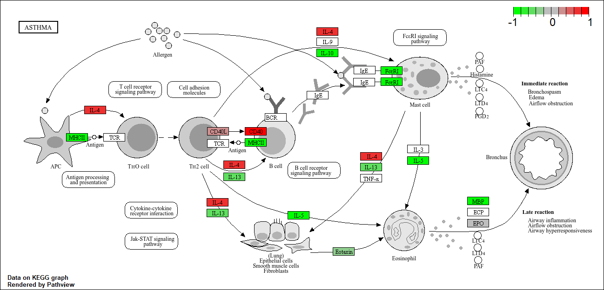

# Class 13 - RNA Seq Data
Ana Karolina Navarro (PID: A19106745)

## Background

Today we will perform an RNASeq analysis of the effects of a common
steroid on airway cells.

In paerticular, dexamethasone (herafter just called “dex”) on different
airway smooth muscle cell lines (ASM cells).

## Data Import

We need two different inputs:

- **countData**: with genes in rows and experiments in columns
- **colData**: meta data that described the columns in countData

``` r
counts <- read.csv("airway_scaledcounts.csv", row.names=1)
metadata <- read.csv("airway_metadata.csv")
```

``` r
head(counts)
```

                    SRR1039508 SRR1039509 SRR1039512 SRR1039513 SRR1039516
    ENSG00000000003        723        486        904        445       1170
    ENSG00000000005          0          0          0          0          0
    ENSG00000000419        467        523        616        371        582
    ENSG00000000457        347        258        364        237        318
    ENSG00000000460         96         81         73         66        118
    ENSG00000000938          0          0          1          0          2
                    SRR1039517 SRR1039520 SRR1039521
    ENSG00000000003       1097        806        604
    ENSG00000000005          0          0          0
    ENSG00000000419        781        417        509
    ENSG00000000457        447        330        324
    ENSG00000000460         94        102         74
    ENSG00000000938          0          0          0

``` r
metadata
```

              id     dex celltype     geo_id
    1 SRR1039508 control   N61311 GSM1275862
    2 SRR1039509 treated   N61311 GSM1275863
    3 SRR1039512 control  N052611 GSM1275866
    4 SRR1039513 treated  N052611 GSM1275867
    5 SRR1039516 control  N080611 GSM1275870
    6 SRR1039517 treated  N080611 GSM1275871
    7 SRR1039520 control  N061011 GSM1275874
    8 SRR1039521 treated  N061011 GSM1275875

``` r
head(metadata)
```

              id     dex celltype     geo_id
    1 SRR1039508 control   N61311 GSM1275862
    2 SRR1039509 treated   N61311 GSM1275863
    3 SRR1039512 control  N052611 GSM1275866
    4 SRR1039513 treated  N052611 GSM1275867
    5 SRR1039516 control  N080611 GSM1275870
    6 SRR1039517 treated  N080611 GSM1275871

> Q.1 How many genes are in this dataset?

``` r
nrow(counts)
```

    [1] 38694

> Q.2 How many ‘control’ cell lines do we have?

``` r
table(metadata$dex)
```


    control treated 
          4       4 

OR

``` r
sum(metadata$dex == "control")
```

    [1] 4

## Differential Gene Expression

We have 4 replicate drug treated and control (no drug)
columns/experiments in our `counts` object.

We want one “mean” value for each gene (rows) in “treated” (drug) and
one mean value for each gene in “control” cols

Step 1. Find all “control” columns Step 2. Extract these columns to a
new object called `control.counts` Step 3. Then calculate the mean value
for each gene

> Q.3 How would you make either approach more robust? Is there a
> function that could help here? rowMeans()

Step 1.

``` r
contol.inds<- metadata$dex == "control"
```

Step 2.

``` r
control.counts <- counts[ , contol.inds]
head(control.counts)
```

                    SRR1039508 SRR1039512 SRR1039516 SRR1039520
    ENSG00000000003        723        904       1170        806
    ENSG00000000005          0          0          0          0
    ENSG00000000419        467        616        582        417
    ENSG00000000457        347        364        318        330
    ENSG00000000460         96         73        118        102
    ENSG00000000938          0          1          2          0

Step 3.

``` r
control.means <- rowMeans(control.counts)
```

> Q.4 Now do the same thing for the “treated” coulumns/experiments

Step 1.

``` r
treat.inds<- metadata$dex == "treated"
```

Step 2.

``` r
treat.counts <- counts[ , treat.inds]
head(treat.counts)
```

                    SRR1039509 SRR1039513 SRR1039517 SRR1039521
    ENSG00000000003        486        445       1097        604
    ENSG00000000005          0          0          0          0
    ENSG00000000419        523        371        781        509
    ENSG00000000457        258        237        447        324
    ENSG00000000460         81         66         94         74
    ENSG00000000938          0          0          0          0

Step 3.

``` r
treat.means <- rowMeans(treat.counts)
```

Put these together for easy book-seeping as `meancounts`

``` r
meancounts <- data.frame (control.means, treat.means)
```

> Q.5a Create a scatter plot showing the mean of the treated samples
> against the mean of the control samples. Your plot should look
> something like the following.

``` r
plot (meancounts)
```


> Q.5b You could also use the ggplot2 package to make this figure
> producing the plot below. What geom\_?() function would you use for
> this plot? geom_point()

Let’s log transform this count data:

> Q6. Try plotting both axes on a log scale. What is the argument to
> plot() that allows you to do this? log =

``` r
plot(meancounts, log = "xy")
```

    Warning in xy.coords(x, y, xlabel, ylabel, log): 15032 x values <= 0 omitted
    from logarithmic plot

    Warning in xy.coords(x, y, xlabel, ylabel, log): 15281 y values <= 0 omitted
    from logarithmic plot


**N.B.** We most often use log2 for this type of data as it makes the
interpretation much more straightforward.

Treated/Controlled is often called “fold-change”.

If there was no change we would have log2-fc of zero:

``` r
log2(10/10)
```

    [1] 0

If we had double the amount of transcript around we would have log2-fc
of 1

``` r
log2(20/10)
```

    [1] 1

If we would have half as mcuh transciprt around we would have log2-fc of
-1

``` r
log2(5/10)
```

    [1] -1

> Q. calculate a log2 fold change value for all our genes and add it as
> a new column to our `meancounts` object

``` r
meancounts$log2f <- log2( meancounts$treat.means / meancounts$control.means )

head(meancounts)
```

                    control.means treat.means       log2f
    ENSG00000000003        900.75      658.00 -0.45303916
    ENSG00000000005          0.00        0.00         NaN
    ENSG00000000419        520.50      546.00  0.06900279
    ENSG00000000457        339.75      316.50 -0.10226805
    ENSG00000000460         97.25       78.75 -0.30441833
    ENSG00000000938          0.75        0.00        -Inf

``` r
zero.vals <- which(meancounts[,1:2]==0, arr.ind=TRUE)

to.rm <- unique(zero.vals[,1])
mycounts <- meancounts[-to.rm,]
head(mycounts)
```

                    control.means treat.means       log2f
    ENSG00000000003        900.75      658.00 -0.45303916
    ENSG00000000419        520.50      546.00  0.06900279
    ENSG00000000457        339.75      316.50 -0.10226805
    ENSG00000000460         97.25       78.75 -0.30441833
    ENSG00000000971       5219.00     6687.50  0.35769358
    ENSG00000001036       2327.00     1785.75 -0.38194109

> Q7. What is the purpose of the arr.ind argument in the which()
> function call above? Why would we then take the first column of the
> output and need to call the unique() function? To get matrix of row
> and column indices where condition is TRUE. unique() removes duplicate
> rows when condition is TRUE multiple times in different columns.

> Q8. Using the up.ind vector above can you determine how many up
> regulated genes we have at the greater than 2 fc level?

> Q9. Using the down.ind vector above can you determine how many down
> regulated genes we have at the greater than 2 fc level?

``` r
up.ind <- mycounts$log2fc > 2
down.ind <- mycounts$log2fc < (-2)
```

\[1\] “Up: 250” \[1\] “Down: 367”

> Q10. Do you trust these results? Why or why not? We have not done
> anything yet to determine whether the differences we are seeing are
> significant. These results in their current form are likely to be very
> misleading.

## DESeq analysis

Let’ do this analysis with an estimate of stastical signficance using
the **DESeq2** pasckage.

``` r
library(DESeq2)
```

DESeq (like many bioconductor oackages) wants its input data in a very
specific way.

``` r
dds <- DESeqDataSetFromMatrix(countData = counts, 
                       colData = metadata, 
                       design = ~dex)
```

    converting counts to integer mode

    Warning in DESeqDataSet(se, design = design, ignoreRank): some variables in
    design formula are characters, converting to factors

## Run the DESeq analysis pipeline

The main function `deseq()`

``` r
dds <- DESeq(dds)
```

    estimating size factors

    estimating dispersions

    gene-wise dispersion estimates

    mean-dispersion relationship

    final dispersion estimates

    fitting model and testing

``` r
results(dds)
```

    log2 fold change (MLE): dex treated vs control 
    Wald test p-value: dex treated vs control 
    DataFrame with 38694 rows and 6 columns
                     baseMean log2FoldChange     lfcSE      stat    pvalue
                    <numeric>      <numeric> <numeric> <numeric> <numeric>
    ENSG00000000003  747.1942     -0.3507030  0.168246 -2.084470 0.0371175
    ENSG00000000005    0.0000             NA        NA        NA        NA
    ENSG00000000419  520.1342      0.2061078  0.101059  2.039475 0.0414026
    ENSG00000000457  322.6648      0.0245269  0.145145  0.168982 0.8658106
    ENSG00000000460   87.6826     -0.1471420  0.257007 -0.572521 0.5669691
    ...                   ...            ...       ...       ...       ...
    ENSG00000283115  0.000000             NA        NA        NA        NA
    ENSG00000283116  0.000000             NA        NA        NA        NA
    ENSG00000283119  0.000000             NA        NA        NA        NA
    ENSG00000283120  0.974916      -0.668258   1.69456 -0.394354  0.693319
    ENSG00000283123  0.000000             NA        NA        NA        NA
                         padj
                    <numeric>
    ENSG00000000003  0.163035
    ENSG00000000005        NA
    ENSG00000000419  0.176032
    ENSG00000000457  0.961694
    ENSG00000000460  0.815849
    ...                   ...
    ENSG00000283115        NA
    ENSG00000283116        NA
    ENSG00000283119        NA
    ENSG00000283120        NA
    ENSG00000283123        NA

``` r
res <- results(dds)
head(res)
```

    log2 fold change (MLE): dex treated vs control 
    Wald test p-value: dex treated vs control 
    DataFrame with 6 rows and 6 columns
                      baseMean log2FoldChange     lfcSE      stat    pvalue
                     <numeric>      <numeric> <numeric> <numeric> <numeric>
    ENSG00000000003 747.194195     -0.3507030  0.168246 -2.084470 0.0371175
    ENSG00000000005   0.000000             NA        NA        NA        NA
    ENSG00000000419 520.134160      0.2061078  0.101059  2.039475 0.0414026
    ENSG00000000457 322.664844      0.0245269  0.145145  0.168982 0.8658106
    ENSG00000000460  87.682625     -0.1471420  0.257007 -0.572521 0.5669691
    ENSG00000000938   0.319167     -1.7322890  3.493601 -0.495846 0.6200029
                         padj
                    <numeric>
    ENSG00000000003  0.163035
    ENSG00000000005        NA
    ENSG00000000419  0.176032
    ENSG00000000457  0.961694
    ENSG00000000460  0.815849
    ENSG00000000938        NA

## Volcano Plot

This is a main summary results figure from these kinds of studies. It is
a plot of Log2- fold-change vs P-value.

``` r
plot(res$log2FoldChange, 
     res$padj)
```


Again this y-axis is highly skewed and needs log transforming and we can
flip the y-axis with a minus sign so it looks lke every other volcano
plot.

``` r
plot(res$log2FoldChange,
     -log(res$padj))
abline(v=-2, col="red")
abline(v=+2, col="red")
abline(h=-log(0.05), col="red")
```


## Adding some color annotation

Start with a default base color “grey”

``` r
mycols <- rep("gray", nrow(res))
mycols[ res$log2FoldChange > 2] <- "blue"
mycols[ res$log2FoldChange < -2] <- "darkgreen"

mycols[ res$padj >= 0.05 ] <-"gray"

head(res$log2FoldChange > 2)
```

    [1] FALSE    NA FALSE FALSE FALSE FALSE

``` r
plot(res$log2FoldChange,
     -log(res$padj),
  col=mycols)

abline(v=c(-2, +2), lty=2)
abline(h=-log(0.05), lty=2)
```


> Q.Make a presentation quality ggplot version of this plot. Include
> clear axis labels, a clean theme, your custom colors, cut-off lines
> and a plot title.

``` r
library(ggplot2)

ggplot(res) +
  aes(log2FoldChange, 
     -log(padj)) + 
  
  geom_point(colour = mycols) +
  labs(x="Log2 Fold-change",
       y="-log Adjusted P-value",  
       title = "Volcano Plot of Differential Gene Expression") +
  
   theme_minimal(base_size = 12) +
  theme(
    plot.title = element_text(face = "bold", hjust = 0.5),
    axis.title = element_text(face = "bold"),
    legend.title = element_text(face = "bold"),
    panel.grid.minor = element_blank()
    
  )
```

    Warning: Removed 23549 rows containing missing values or values outside the scale range
    (`geom_point()`).


## Save our results

Write a CSV file

``` r
write.csv(res, file="results.csv")
```

## Add Annotation Data

We need to add missing annotation data to our main `res` results object.
This includes the common gene “symbol”

``` r
head(res)
```

    log2 fold change (MLE): dex treated vs control 
    Wald test p-value: dex treated vs control 
    DataFrame with 6 rows and 6 columns
                      baseMean log2FoldChange     lfcSE      stat    pvalue
                     <numeric>      <numeric> <numeric> <numeric> <numeric>
    ENSG00000000003 747.194195     -0.3507030  0.168246 -2.084470 0.0371175
    ENSG00000000005   0.000000             NA        NA        NA        NA
    ENSG00000000419 520.134160      0.2061078  0.101059  2.039475 0.0414026
    ENSG00000000457 322.664844      0.0245269  0.145145  0.168982 0.8658106
    ENSG00000000460  87.682625     -0.1471420  0.257007 -0.572521 0.5669691
    ENSG00000000938   0.319167     -1.7322890  3.493601 -0.495846 0.6200029
                         padj
                    <numeric>
    ENSG00000000003  0.163035
    ENSG00000000005        NA
    ENSG00000000419  0.176032
    ENSG00000000457  0.961694
    ENSG00000000460  0.815849
    ENSG00000000938        NA

We will use R and bioconductor to do this “ID mapping”

``` r
library("AnnotationDbi")
library("org.Hs.eg.db")
```

``` r
columns(org.Hs.eg.db)
```

     [1] "ACCNUM"       "ALIAS"        "ENSEMBL"      "ENSEMBLPROT"  "ENSEMBLTRANS"
     [6] "ENTREZID"     "ENZYME"       "EVIDENCE"     "EVIDENCEALL"  "GENENAME"    
    [11] "GENETYPE"     "GO"           "GOALL"        "IPI"          "MAP"         
    [16] "OMIM"         "ONTOLOGY"     "ONTOLOGYALL"  "PATH"         "PFAM"        
    [21] "PMID"         "PROSITE"      "REFSEQ"       "SYMBOL"       "UCSCKG"      
    [26] "UNIPROT"     

We can use the `mapIds()` function now to “translate” between any of
these databases

``` r
res$symbol <- mapIds(org.Hs.eg.db,
                     keys=row.names(res), # Our genenames
                     keytype="ENSEMBL",        # Their format
                     column="SYMBOL",)          # Format we want
```

    'select()' returned 1:many mapping between keys and columns

> Q. Also add “ENTREZID”, “GENENAME”

``` r
res$entrez <- mapIds(org.Hs.eg.db,
                     keys=row.names(res), # Our genenames
                     keytype="ENSEMBL",        # Their format
                     column="ENTREZID",)          # Format we want
```

    'select()' returned 1:many mapping between keys and columns

``` r
res$genename <- mapIds(org.Hs.eg.db,
                     keys=row.names(res), # Our genenames
                     keytype="ENSEMBL",        # Their format
                     column="GENENAME",)          # Format we want
```

    'select()' returned 1:many mapping between keys and columns

``` r
head(res)
```

    log2 fold change (MLE): dex treated vs control 
    Wald test p-value: dex treated vs control 
    DataFrame with 6 rows and 9 columns
                      baseMean log2FoldChange     lfcSE      stat    pvalue
                     <numeric>      <numeric> <numeric> <numeric> <numeric>
    ENSG00000000003 747.194195     -0.3507030  0.168246 -2.084470 0.0371175
    ENSG00000000005   0.000000             NA        NA        NA        NA
    ENSG00000000419 520.134160      0.2061078  0.101059  2.039475 0.0414026
    ENSG00000000457 322.664844      0.0245269  0.145145  0.168982 0.8658106
    ENSG00000000460  87.682625     -0.1471420  0.257007 -0.572521 0.5669691
    ENSG00000000938   0.319167     -1.7322890  3.493601 -0.495846 0.6200029
                         padj      symbol      entrez               genename
                    <numeric> <character> <character>            <character>
    ENSG00000000003  0.163035      TSPAN6        7105          tetraspanin 6
    ENSG00000000005        NA        TNMD       64102            tenomodulin
    ENSG00000000419  0.176032        DPM1        8813 dolichyl-phosphate m..
    ENSG00000000457  0.961694       SCYL3       57147 SCY1 like pseudokina..
    ENSG00000000460  0.815849       FIRRM       55732 FIGNL1 interacting r..
    ENSG00000000938        NA         FGR        2268 FGR proto-oncogene, ..

## Save Annotated Results to a CSV file

``` r
write.csv(res, file="results_annotated.csv")
```

## Pathway Analysis

> Q. What known biological pathway do our differentially expressed genes
> overlap with (i.e play a role in)?

There’s lots of bioconductor packages to do this type of analysis.

We will use one of the oldest called **gage** along with **pathview** to
render nice pics of the pathways we find.

We can install these with the comman `BiocManager::Install()`

``` r
library(pathview)
library(gage)
library(gageData)
```

``` r
# Examine the first 2 pathways in this kegg set for humans
data(kegg.sets.hs)
head(kegg.sets.hs, 2)
```

    $`hsa00232 Caffeine metabolism`
    [1] "10"   "1544" "1548" "1549" "1553" "7498" "9"   

    $`hsa00983 Drug metabolism - other enzymes`
     [1] "10"     "1066"   "10720"  "10941"  "151531" "1548"   "1549"   "1551"  
     [9] "1553"   "1576"   "1577"   "1806"   "1807"   "1890"   "221223" "2990"  
    [17] "3251"   "3614"   "3615"   "3704"   "51733"  "54490"  "54575"  "54576" 
    [25] "54577"  "54578"  "54579"  "54600"  "54657"  "54658"  "54659"  "54963" 
    [33] "574537" "64816"  "7083"   "7084"   "7172"   "7363"   "7364"   "7365"  
    [41] "7366"   "7367"   "7371"   "7372"   "7378"   "7498"   "79799"  "83549" 
    [49] "8824"   "8833"   "9"      "978"   

The main `gage()` function that does the work wants a simple vector as
input.

``` r
foldchanges <- res$log2FoldChange
names(foldchanges) <- res$symbol
head(foldchanges)
```

         TSPAN6        TNMD        DPM1       SCYL3       FIRRM         FGR 
    -0.35070302          NA  0.20610777  0.02452695 -0.14714205 -1.73228897 

The Keg database uses ENTREZ ids so we need to provide these in our
input

``` r
names(foldchanges) <- res$entrez
```

Now we can run `gage()`

``` r
# Get the results

keggres = gage(foldchanges, gsets=kegg.sets.hs)
```

What is in the output object `keggres`

``` r
attributes(keggres)
```

    $names
    [1] "greater" "less"    "stats"  

``` r
# Look at the first three down (less) pathways
head(keggres$less, 3)
```

                                          p.geomean stat.mean        p.val
    hsa05332 Graft-versus-host disease 0.0004250461 -3.473346 0.0004250461
    hsa04940 Type I diabetes mellitus  0.0017820293 -3.002352 0.0017820293
    hsa05310 Asthma                    0.0020045888 -3.009050 0.0020045888
                                            q.val set.size         exp1
    hsa05332 Graft-versus-host disease 0.09053483       40 0.0004250461
    hsa04940 Type I diabetes mellitus  0.14232581       42 0.0017820293
    hsa05310 Asthma                    0.14232581       29 0.0020045888

We can use **pathview** function to render a figure of any of these
pathways along with annotation for our DEGs

Let’s see the hsa05310 Asthma pathway with our DEGs colored up:

``` r
pathview(gene.data=foldchanges, pathway.id="hsa05310")
```

    'select()' returned 1:1 mapping between keys and columns

    Info: Working in directory C:/Users/anaka/OneDrive/Desktop/BIMM 143 R WORKSPACE/bimm143_github_redo/class13

    Info: Writing image file hsa05310.pathview.png



> Q. Can you render and insert here the pathway figure for
> “Graft-versus-host disease” and “Type I diabetes”?

``` r
pathview(gene.data=foldchanges, pathway.id="hsa05332")
```

    'select()' returned 1:1 mapping between keys and columns

    Info: Working in directory C:/Users/anaka/OneDrive/Desktop/BIMM 143 R WORKSPACE/bimm143_github_redo/class13

    Info: Writing image file hsa05332.pathview.png


``` r
pathview(gene.data=foldchanges, pathway.id="hsa04940")
```

    'select()' returned 1:1 mapping between keys and columns

    Info: Working in directory C:/Users/anaka/OneDrive/Desktop/BIMM 143 R WORKSPACE/bimm143_github_redo/class13

    Info: Writing image file hsa04940.pathview.png


